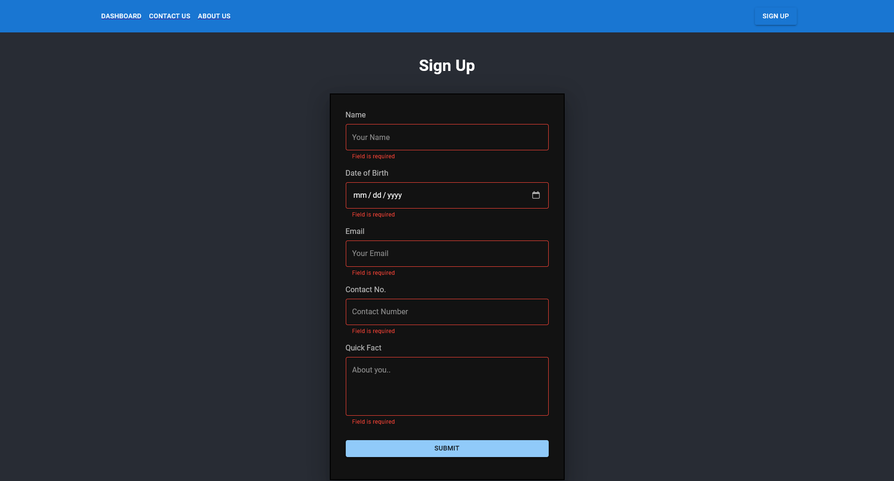
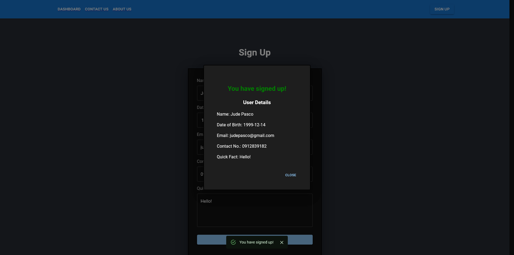

# React Assessment 4

## Description
React assessment 4 for react routing and form.  

A Navigation bar is added with the links for the following pages: [Dashboard](#dashboard-page), [Contact Us](#contact-us-page), [About Us](#about-us-page), and [Sign Up](#sign-up-page). 

Again, dark mode is applied to all except the header to keep the blue color :)

Here are the pages:
### Dashboard page 
- contains the list of users from an [API](https://jsonplaceholder.typicode.com/users).   

### Contact Us page
- contains the cards for contact no., address, and email. Google maps is also implemented with the default location of Philippines

### About Us page
- has a random image of a mountain and some lorem text

### Sign Up page
- contains the form that was created in the earlier assessment. Upon submitting, a modal and snackbar will appear.

## Author
Jude Pasco  
Cohort #28

## Screenshots

### Dashboard

### Contact Us

### About Us

### Sign Up

